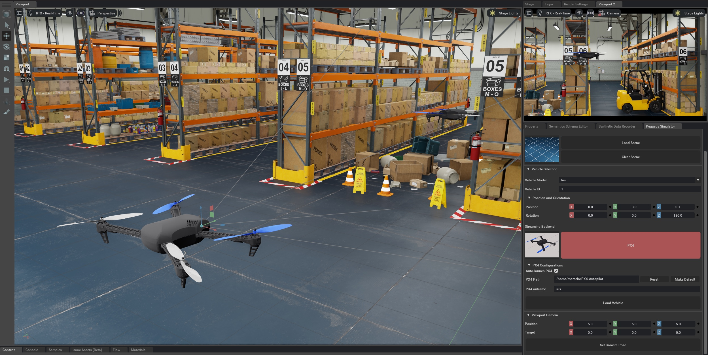
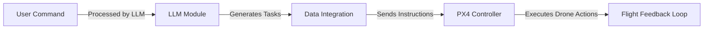

# LLM Agent for Drone Control

[](https://docs.px4.io/main/en/releases/1.14.html)
[](https://docs.isaacsim.omniverse.nvidia.com/latest/index.html)
[](https://docs.ros.org/en/humble/Installation/Ubuntu-Install-Debs.html)
[](https://docs.qgroundcontrol.com/master/en/qgc-user-guide/getting_started/quick_start.html)
[](https://docs.python.org/3/whatsnew/3.10.html)
[](https://releases.ubuntu.com/22.04/)


> **Next-generation AI-powered drone control.**
> A fully autonomous drone system integrating **LLMs**, **Computer Vision**, and **PX4 Autopilot**.

🔹 **Natural Language Command Execution**
🔹 **Real-time Sensor Integration**
🔹 **Simulation & Physical Deployment Support**



---

## 📜 Table of Contents

<details>
  <summary>🔍 Click to Expand</summary>

1. [🌟 Project Overview](#-project-overview)
2. [📐 System Architecture](#-system-architecture)
3. [🛠️ Installation Guide](#installation-guide)
4. [🚀 Directions to Run the Project](#directions-to-run-the-project)
5. [🎯 Expected Results](#expected-results)
6. [🔍 Troubleshooting](#troubleshooting)
7. [🎥 Demo Video](#demo-video)
8. [👨‍💻 Contributors](#contributors)
9. [📜 License](#license)

</details>
  
---

## 🌟 Project Overview

This project focuses on developing a natural language-controlled drone system that minimizes human intervention. The system allows users to command a PX4 drone via natural language prompts, integrating cutting-edge technologies:

- 🚀 **Large Language Models (LLMs)** for interpreting user commands.
- 🎮 **NVIDIA ISAAC SIM** for sensor simulation.
- 🖼️ **Computer Vision** for object detection and depth estimation.
- 🔗 **MAVLink** for drone communication.
- ✈️ **PX4-Autopilot** for controlling drone actions.

The system translates natural language instructions into mission commands that enable autonomous drone operation, offering flexibility and scalability for real-world applications.


---

## 📐 System Architecture
<br clear="left">

<div style="display: flex; align-items: center;">
  <div style="flex: 1;">
  <div style="flex: 1;">


  </div>
  <div style="flex: 1; padding-left: 20px;">
    <p>The system architecture involves several interconnected components working seamlessly together:</p>
    <ul>
      <li><strong>User Input Layer:</strong> Receives natural language commands from the user.</li>
      <li><strong>LLM Processing Unit:</strong> Interprets and translates commands into actionable tasks.</li>
      <li><strong>Data Integration Module:</strong> Integrates sensor and vision data into the command processing pipeline.</li>
      <li><strong>Execution Layer:</strong> Converts processed commands into PX4-compatible instructions and executes them.</li>
      <li><strong>Feedback Loop:</strong> Collects and processes data from sensors to refine ongoing operations.</li>
    </ul>
  </div>
</div>

---

## 🛠️ Installation Guide

### 1. Clone the Repository
```bash
git clone https://github.com/Bapiggott/IsaacDroneControl.git
cd IsaacDroneControl
```

### 2. Install Dependencies
Ensure Python is installed, then run:
```bash
pip install -r requirements.txt
```

### 3. Install Omniverse Launcher
Download the Omniverse Launcher:
```bash
wget https://install.launcher.omniverse.nvidia.com/installers/omniverse-launcher-linux.AppImage
chmod +x omniverse-launcher-linux.AppImage
./omniverse-launcher-linux.AppImage
```

### 4. Install Required Software

| Software | Description | Installation Guide |
|----------|-------------|------------------|
| **ROS 2 Humble** | 🤖 Seamless robot operating system integration. | [Install Here](https://docs.ros.org/en/humble/Installation/Ubuntu-Install-Debs.html) |
| **NVIDIA ISAAC SIM** | 🎮 Simulate realistic drone environments. | [Install Here](https://docs.omniverse.nvidia.com/isaacsim/latest/installation/install_workstation.html) |
| **Pegasus Simulator** | ✈️ High-fidelity drone flight simulations. | [Install Here](https://pegasussimulator.github.io/PegasusSimulator/source/setup/installation.html#installing-the-pegasus-simulator) |

### 4. Verify Setup
Confirm all dependencies and software are correctly installed.

---

## 🚀 Directions to Run the Project

### Command-Line Arguments

The system can be run with the following options to control specific components:
| Argument | Short | Description | Default |
|----------|-------|-------------|---------|
| `--llm_model_name` | `-l` | Name of the language model | `deepseek-r1:8b` |
| `--vlm_model_name` | `-v` | Name of the vision model | `llama3.2-vision` |
| `--interface_port` | `-p` | Port on which the web interface runs | `http://localhost:5000` |
| `--vlm_api_url` | `-va` | API endpoint for the VLM | `http://localhost:8889` |
| `--llm_api_url` | `-la` | API endpoint for the Ollama LLM | `http://localhost:8888` |
| `--components` | `-c` | Choose which components to start (`qgroundcontrol`, `ollama`, `image_server`, or `all`) | `all` |

### Example Commands

#### Run IsaacSim Environment with Pegasus
Before starting the main components, ensure the Isaac Sim world is running:
```bash
ISAACSIM_PYTHON isaac_sim_world.py
```

#### Start All Components

```bash
python3 start_system.py -c all
```

#### Start Specific Components
To start only specific components like QGroundControl and the Image Server:
```bash
python3 start_system.py --components=qgroundcontrol,image_server
```

### Access the User Interface
- Once started, navigate to `http://localhost:5000` in your browser to interact with the system.
- Provide Natural Language Commands
  - Use the interface to input commands like "survey area" or "capture images of an object."
- Analyze Mission Data
  - Output data is saved in mission-specific directories within the project folder.
  
---

## 🎯 Expected Results

- **Depth Data:** Displays accurate depth estimations.
- **Mission Logs:** Visualized using [PX4 Log Analysis Tool](https://logs.px4.io/).
- **Object Detection:** JSON files contain detection details for mission objects.

---

## 🔍 Troubleshooting

<details>
  <summary>🛠️ Click for Common Issues & Fixes</summary>

- **Component Not Starting?** Ensure dependencies are installed and verify configurations.
- **Simulation Lag?** Allocate more system resources or lower rendering settings.
- **Interface Not Loading?** Confirm `--interface_port` is correctly set.

</details>

---

## 🎥 Demo Video

[](https://example.com/demo)

---

## 👨‍💻 Contributors

- **Brett Piggott** - [GitHub](https://github.com/Bapiggott)
- **The rest of our team...**

---

## 📜 License

This project is licensed under...
<!--the MIT License. See the LICENSE file for details.

-->
