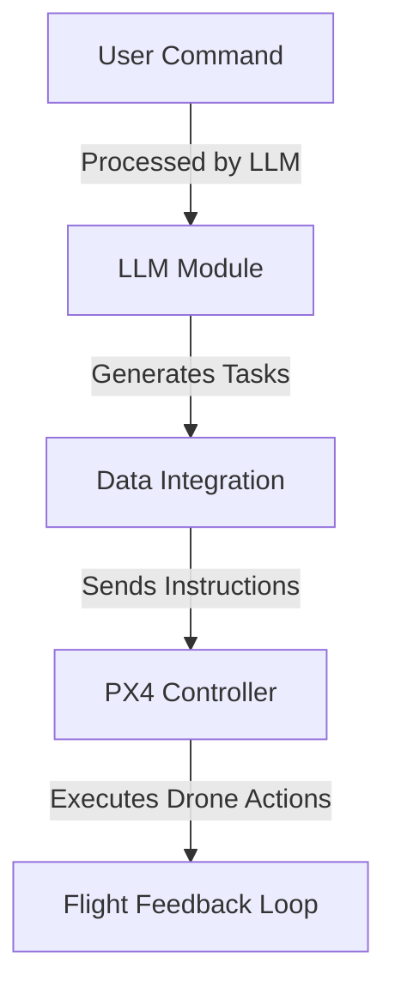

# 🚀 LLM Agent for Drone Control


[](https://docs.px4.io/main/en/releases/1.14.html)
[](https://docs.isaacsim.omniverse.nvidia.com/latest/index.html)
[](https://docs.ros.org/en/humble/Installation/Ubuntu-Install-Debs.html)
[](https://docs.qgroundcontrol.com/master/en/qgc-user-guide/getting_started/quick_start.html)
[](https://docs.python.org/3/whatsnew/3.10.html)
[](https://releases.ubuntu.com/22.04/)

---

## 📜 Table of Contents

<details>
  <summary>🔍 Click to Expand</summary>

1. [🌟 Project Overview](#-project-overview)
2. [📐 System Architecture](#-system-architecture)
3. [🛠️ Installation Guide](#installation-guide)
4. [🚀 Directions to Run the Project](#directions-to-run-the-project)
5. [🎯 Expected Results](#expected-results)
6. [🔍 Troubleshooting](#troubleshooting)
7. [🎥 Demo Video](#demo-video)
8. [👨‍💻 Contributors](#contributors)
9. [📜 License](#license)

</details>

---

## 🌟 Project Overview

> **Next-generation AI-powered drone control.**
> A fully autonomous drone system integrating **LLMs**, **Computer Vision**, and **PX4 Autopilot**.

🔹 **Natural Language Command Execution**
🔹 **Real-time Sensor Integration**
🔹 **Simulation & Physical Deployment Support**


---

## 📐 System Architecture


### Overview
The system architecture involves several interconnected components working seamlessly together:

- **User Input Layer:** Receives natural language commands from the user.
- **LLM Processing Unit:** Interprets and translates commands into actionable tasks.
- **Data Integration Module:** Integrates sensor and vision data into the command processing pipeline.
- **Execution Layer:** Converts processed commands into PX4-compatible instructions and executes them.
- **Feedback Loop:** Collects and processes data from sensors to refine ongoing operations.

<br clear="left">

<div style="display: flex; align-items: center;">
  <div style="flex: 0.5;">
  <div style="flex: 0.5;">


  </div>
  <div style="flex: 1; padding-left: 20px;">
    <p>The system architecture involves several interconnected components working seamlessly together:</p>
    <ul>
      <li><strong>User Input Layer:</strong> Receives natural language commands from the user.</li>
      <li><strong>LLM Processing Unit:</strong> Interprets and translates commands into actionable tasks.</li>
      <li><strong>Data Integration Module:</strong> Integrates sensor and vision data into the command processing pipeline.</li>
      <li><strong>Execution Layer:</strong> Converts processed commands into PX4-compatible instructions and executes them.</li>
      <li><strong>Feedback Loop:</strong> Collects and processes data from sensors to refine ongoing operations.</li>
    </ul>
  </div>
</div>

---

## 🛠️ Installation Guide

### 1. Clone the Repository
```bash
git clone https://github.com/Bapiggott/IsaacDroneControl.git
cd IsaacDroneControl
```

### 2. Install Dependencies
```bash
pip install -r requirements.txt
```

### 3. Install Required Software

| Software | Installation Guide |
|----------|------------------|
| **ROS 2 Humble** | [Install Here](https://docs.ros.org/en/humble/Installation/Ubuntu-Install-Debs.html) |
| **NVIDIA ISAAC SIM** | [Install Here](https://docs.omniverse.nvidia.com/isaacsim/latest/installation/install_workstation.html) |
| **Pegasus Simulator** | [Install Here](https://pegasussimulator.github.io/PegasusSimulator/source/setup/installation.html#installing-the-pegasus-simulator) |

### 4. Verify Setup
Confirm all dependencies and software are correctly installed.

---

## 🚀 Directions to Run the Project

### 1. Start Isaac Sim World
```bash
ISAACSIM_PYTHON isaac_sim_world.py
```

### 2. Start Main System Components
```bash
python3 start_system.py --components=all
```

#### Alternative: Run Specific Components
```bash
python3 start_system.py -c qgroundcontrol,image_server
```

### Access the Interface
Navigate to [`http://localhost:8080`](http://localhost:8080) in your browser.

---

## 🎯 Expected Results

- 📍 **Depth Data:** Displays accurate depth estimations.
- 📊 **Mission Logs:** Visualized using [PX4 Log Analysis Tool](https://logs.px4.io/).
- 🎯 **Object Detection:** JSON files contain detection details for mission objects.

---

## 🔍 Troubleshooting

<details>
  <summary>🛠️ Click for Common Issues & Fixes</summary>

- **Component Not Starting?** Ensure dependencies are installed and verify configurations.
- **Simulation Lag?** Allocate more system resources or lower rendering settings.
- **Interface Not Loading?** Confirm `--interface_port` is correctly set.

</details>

---

## 🎥 Demo Video

[](https://example.com/demo)

---

## 👨‍💻 Contributors

- **Brett Piggott** - [GitHub](https://github.com/Bapiggott)

---

## 📜 License

📄 **MIT License** - See the LICENSE file for details.


